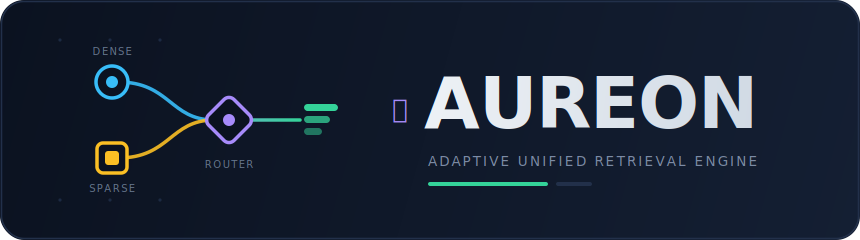

<p align="center">
  
</p>

# ✦ Aureon — Adaptive Unified Retrieval Engine

[](https://python.org)
[](https://numpy.org)
[](https://opensource.org/licenses/MIT)

> Dense + sparse retrieval fusion with a **query router** and an **explain-mode**
> output. Dependency-light core (numpy, scikit-learn, rank-bm25). Drop it into any
> Python app, notebook, or RAG pipeline.

For the full-stack web application built on top of this package, see the
**Aureon Explorer** app in `../app`.

---

## 📖 What Is It?

`aureon` is a Python package that fuses a **sparse** retriever (BM25 — exact
lexical match) with a **dense** retriever (semantic embeddings) and lets a
per-query **router** decide how much to trust each one. Lexical queries (codes,
IDs, entities) lean sparse; conceptual paraphrases lean dense — automatically.

> **The honest thesis.** Vanilla hybrid search is a solved problem: Reciprocal
> Rank Fusion (RRF) already beats naive weighted score fusion and is what every
> vector DB ships. So the contribution here is *not* fusion — it's the **router**
> that picks the dense/sparse weight per query. `aureon.benchmark` measures whether
> that router beats RRF, with an **oracle** (hindsight-optimal) upper bound to
> show how much headroom a better router could capture.

Aureon is not a black box. Every query returns a full **explanation**: the raw
dense score, raw sparse score, chosen weight, fused score, and final rank for
each candidate — designed in from day one so downstream demos and audits never
have to guess.

---
## Demo Video


---

## 📦 Installation

Install in editable mode from the package folder (recommended during
development):

```bash
pip install -e .
```

Verify:

```bash
python -c "from aureon import HybridSearch; print('✅ ready')"
```

Optional extras: `pip install -e ".[encoders]"` (real sentence-transformer
encoder for the BEIR test) · `pip install -e ".[dev]"` (pytest).

---

## ⚡ Quick Start

```python
from aureon import HybridSearch

docs = [
    "The FIX protocol session dropped after a heartbeat timeout on gateway GW-09.",
    "We cut our AWS bill by moving batch jobs to spot instances.",
    "A guide to lowering compute expenditure on public cloud.",
]

hs = HybridSearch(docs)                        # LSA dense + BM25 sparse
for r in hs.search("gateway GW-09 timeout", k=3):
    print(f"#{r['rank']}  score={r['score']:.3f}  {r['text']}")
```

That's it. No model download and no API key — the default dense retriever is an
offline LSA (TF-IDF + SVD) stand-in.

---

## 🔍 Explain Mode

Every search can return the full per-candidate breakdown that powers audits,
dashboards, and the 3D demo:

```python
exp = hs.search("lower our public cloud costs", method="adaptive", explain=True)

exp.alpha        # weight the router put on DENSE for this query
exp.meta         # {"lexicality": 0.14, ...} — what the router saw
exp.top(5)       # [{doc, rank, dense, sparse, fused}, ...]
```

---

## 🧮 Fusion Methods

Pass any of these as `method=` to `search()` / `explain()`:

| Family | Methods | Notes |
|---|---|---|
| **Retriever** | `bm25`, `dense` | single-retriever baselines |
| **Score-norm fusion** | `fixed` (alpha=…), `combsum`, `combmnz`, `zscore`, `softmax`, `dbsf` | weighted sum of normalized scores; `dbsf` = Distribution-Based Score Fusion (3σ) |
| **Rank fusion** | `rrf`, `wrrf` (weighted RRF), `isr`, `borda` | score-distribution-agnostic |
| **Routed** | `adaptive` *(default)*, `adaptive_rrf` | per-query dense/sparse weight from the router |
| **Diagnostic** | `oracle` | hindsight-optimal weight — cheating upper bound |

```python
hs.search("q", method="dbsf")                      # distribution-based fusion
hs.search("q", method="combsum", norm="zscore")    # z-score CombSUM
hs.search("q", method="wrrf", weights=(2.0, 1.0))  # dense-tilted weighted RRF
```

---

## 📊 Evaluation Metrics

A data-scientist-grade eval covers **quality** and **efficiency**. Both are
importable standalone and drive the benchmark report.

### Quality (relevance) — `aureon.eval`

| Metric | Function |
|---|---|
| nDCG@k | `ndcg_at_k(order, rel, k)` |
| MRR | `mrr(order, rel)` |
| MAP (per-query AP) | `average_precision(order, rel)` |
| R-Precision | `r_precision(order, rel)` |
| Recall@k / Precision@k | `recall_at_k` / `precision_at_k` |
| Hit / Success@k | `hit_at_k(order, rel, k)` |
| **All at once** | `evaluate(order, rel, ks=(5, 10))` → dict |
| Significance | `paired_bootstrap(a, b)` → (delta, p) |

### Efficiency (latency) — `aureon.timing`

```python
from aureon import measure

stats = measure(lambda: hs.search("q", method="rrf"), repeat=200, warmup=20)
stats.mean_ms, stats.p50_ms, stats.p95_ms, stats.p99_ms, stats.qps
```

`measure()` returns `LatencyStats` (mean / p50 / p95 / p99 latency + throughput
QPS) with warmup and repeats to damp jitter.

---

## 🏁 Benchmark

```bash
aureon-bench        # or: python -m aureon.benchmark
```

Three reports so you can compare every method on the axes that matter:

1. **Quality** — nDCG@10, MRR, MAP, R-Precision, Recall@10, Precision@10 per
   method, plus the lexical-vs-semantic nDCG split (the router thesis).
2. **Efficiency** — per-method fusion latency (mean / p50 / p95 / p99) and
   throughput (QPS), timed on precomputed retriever scores so the numbers
   isolate *fusion* cost; one-off index-build cost is reported alongside.
3. **Significance** — paired bootstrap of `adaptive` / `adaptive_rrf` / `oracle`
   vs the RRF baseline on nDCG@10.

```text
QUALITY (higher is better)
method         nDCG@10      MRR      MAP   R-Prec     R@10     P@10
-------------------------------------------------------------------
rrf              0.919    0.969    0.870    0.823    0.969    0.150
borda            0.920    0.969    0.870    0.823    0.969    0.150
adaptive_rrf     0.910    0.969    0.872    0.823    0.938    0.144
oracle*          0.926    0.969    0.884    0.823    0.969    0.150

EFFICIENCY (fusion cost only)
method         mean_ms   p50_ms   p95_ms   p99_ms       QPS
-----------------------------------------------------------
rrf             0.0057   0.0055   0.0061   0.0067    175367
dbsf            0.0157   0.0152   0.0168   0.0210     63540
oracle*         0.1792   0.1779   0.2044   0.2161      5580
```

**Current result (offline LSA, 36-doc sanity corpus):** the rank fusers
(`rrf`/`wrrf`/`borda`, nDCG@10 ≈ 0.92) lead the score-norm family; `oracle*`
tops out at 0.926; neither router beats RRF significantly (adaptive−RRF ≈ −0.013,
p ≈ 0.14). Read: the concept has headroom, the router doesn't capture it yet.
Numbers are directional until run with a real encoder on BEIR.

---

## 🔌 Pluggable Encoder

Swap the offline LSA stand-in for a real embedding model to run the true gate
(BEIR). If the oracle-vs-RRF gap survives, the router is worth building; if it
collapses, stop.

```python
from sentence_transformers import SentenceTransformer
from aureon import HybridSearch

m = SentenceTransformer("all-MiniLM-L6-v2")
hs = HybridSearch(docs, encoder=lambda texts: m.encode(list(texts)))
```

The corpus interface is deliberately minimal — `docs: list[str]` and
`queries: list[(text, rel_set, type)]` — so any dataset drops straight in.

---

## 🗂️ Package Structure

```
aureon/
├── __init__.py        # public API re-exports
├── core.py            # HybridSearch — the one class you call
├── retrievers.py      # BM25 (sparse) + LSA/encoder (dense)
├── fusion.py          # fusion methods + Explanation contract
├── eval.py            # quality metrics (nDCG, MRR, MAP, ...)
├── timing.py          # efficiency harness (LatencyStats, measure)
├── benchmark.py       # aureon-bench: quality + efficiency + significance
├── data.py            # small controlled corpus (lexical vs semantic)
└── test_smoke.py      # pytest suite
```

---

## 🔧 Tips

- **Start with `adaptive`, compare against `rrf`.** RRF is the honest baseline;
  the router only earns its keep if it beats RRF on *your* data.
- **Isolate fusion cost.** The efficiency report times fusion on precomputed
  scores — retrieval and index-build are shared and reported once.
- **Use `explain=True` for debugging.** When a result looks wrong, the
  per-candidate dense/sparse/fused breakdown tells you which retriever misfired.

---

## 📜 License

MIT © 2026 Debaditya Chakravorty. See the license header below.

```
MIT License

Copyright (c) 2026 Debaditya Chakravorty

Permission is hereby granted, free of charge, to any person obtaining a copy
of this software and associated documentation files (the "Software"), to deal
in the Software without restriction, including without limitation the rights
to use, copy, modify, merge, publish, distribute, sublicense, and/or sell
copies of the Software, and to permit persons to whom the Software is
furnished to do so, subject to the following conditions:

The above copyright notice and this permission notice shall be included in all
copies or substantial portions of the Software.

THE SOFTWARE IS PROVIDED "AS IS", WITHOUT WARRANTY OF ANY KIND, EXPRESS OR
IMPLIED, INCLUDING BUT NOT LIMITED TO THE WARRANTIES OF MERCHANTABILITY,
FITNESS FOR A PARTICULAR PURPOSE AND NONINFRINGEMENT. IN NO EVENT SHALL THE
AUTHORS OR COPYRIGHT HOLDERS BE LIABLE FOR ANY CLAIM, DAMAGES OR OTHER
LIABILITY, WHETHER IN AN ACTION OF CONTRACT, TORT OR OTHERWISE, ARISING FROM,
OUT OF OR IN CONNECTION WITH THE SOFTWARE OR THE USE OR OTHER DEALINGS IN THE
SOFTWARE.
```

---

## 🔖 Cite

If you build on `aureon` in your research, please cite:

```bibtex
@misc{aureon,
  author    = {Debaditya Chakravorty},
  title     = {Aureon: Adaptive Unified Retrieval Engine — Dense + Sparse Fusion with a Query Router},
  year      = {2026},
  publisher = {GitHub},
  url       = {https://github.com/debaditc/aureon}
}
```
